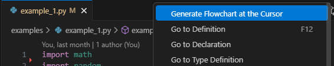
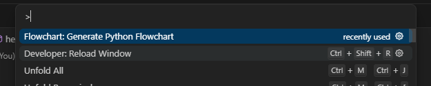
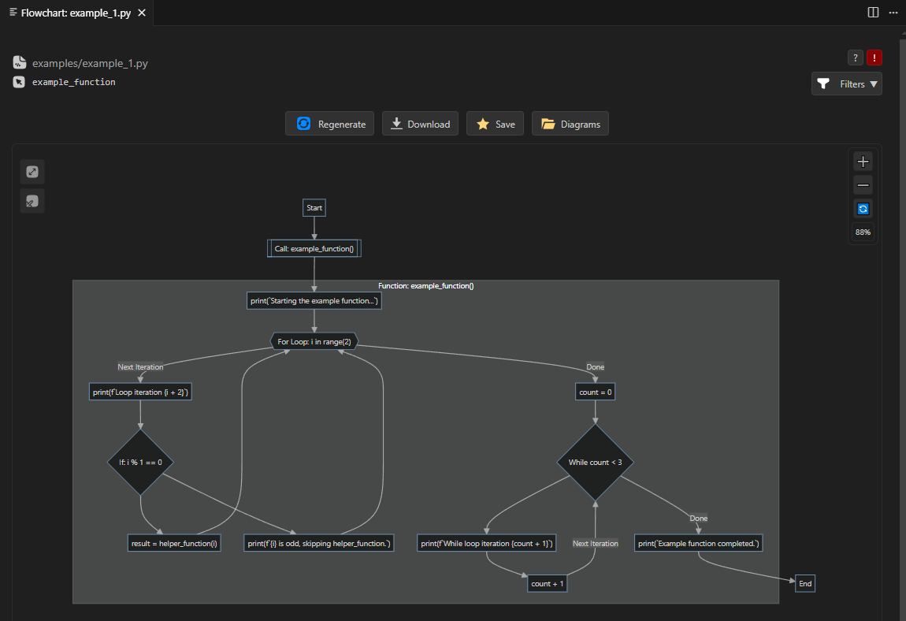

# Flowchart Machine

A VS Code extension that generates flowcharts from Python code using Mermaid diagrams.

## Quick Usage:



or





## Features

- Generate flowcharts from Python files
- Interactive Mermaid diagrams with collapsible subgraphs
- Context menu integration for Python files
- Progress tracking during generation
- Error handling and user feedback

## Installation

### From VSIX (Recommended)

1. Download the `.vsix` file from the releases
2. In VS Code, go to Extensions (Ctrl+Shift+X)
3. Click the "..." menu and select "Install from VSIX..."
4. Select the downloaded `.vsix` file
5. Reload VS Code

### From Source

1. Clone this repository
2. Run `npm install` to install dependencies
3. Run `npm run compile` to compile TypeScript
4. Press F5 in VS Code to run the extension in a new Extension Development Host window

## Usage

1. Open a Python file in VS Code
2. Use one of these methods to generate a flowchart:

   - **Command Palette**: Press `Ctrl+Shift+P` and type "Generate Python Flowchart"
   - **Context Menu**: Right-click in the editor and select "Generate Python Flowchart"
   - **Keyboard Shortcut**: The command will appear in the command palette
3. The extension will:

   - Check if Python is available on your system
   - Use the built-in `main.py` script from the extension's flowchart directory
   - Execute the Python script to generate flowchart data
   - Display the flowchart in a new webview panel

## Requirements

- **Python**: Must be installed and available in your system PATH
- **main.py**: A Python script that generates flowchart data (built into the extension)
- **VS Code**: Version 1.101.0 or higher

## File Structure

```
flowchart-machine/
├── src/
│   └── extension.ts          # Main extension code
├── webview/                  # Webview files
├── out/
│   └── extension.js          # Compiled extension
├── flowchart/                # Extension's Python processing files
│   ├── main.py              # Built-in Python flowchart generator
│   ├── flowchart_processor.py # Core flowchart processing logic
│   └── flowchart_postprocessor.py # Post-processing and optimization
└── package.json              # Extension manifest
```

## Troubleshooting

### Extension Not Working

1. **Check Python Installation**: Ensure Python is installed and accessible via `python --version` or `python3 --version`
2. **Check main.py**: The extension includes its own `main.py` script - no additional files needed
3. **Check Console**: Open VS Code's Developer Console (Help > Toggle Developer Tools) for error messages
4. **Reload Extension**: Try reloading VS Code (Ctrl+Shift+P > "Developer: Reload Window")

### Common Issues

- **"Python is not available"**: Install Python and ensure it's in your system PATH
- **"main.py not found"**: The extension's built-in main.py script is missing - reinstall the extension
- **"Flowchart file not generated"**: Check that `main.py` runs successfully and generates `flowchart.mmd` in the `temp/` folder

## Contributing

1. Fork the repository
2. Create a feature branch
3. Make your changes
4. Run tests and linting
5. Submit a pull request

## License

This project is licensed under the MIT License - see the LICENSE file for details.
